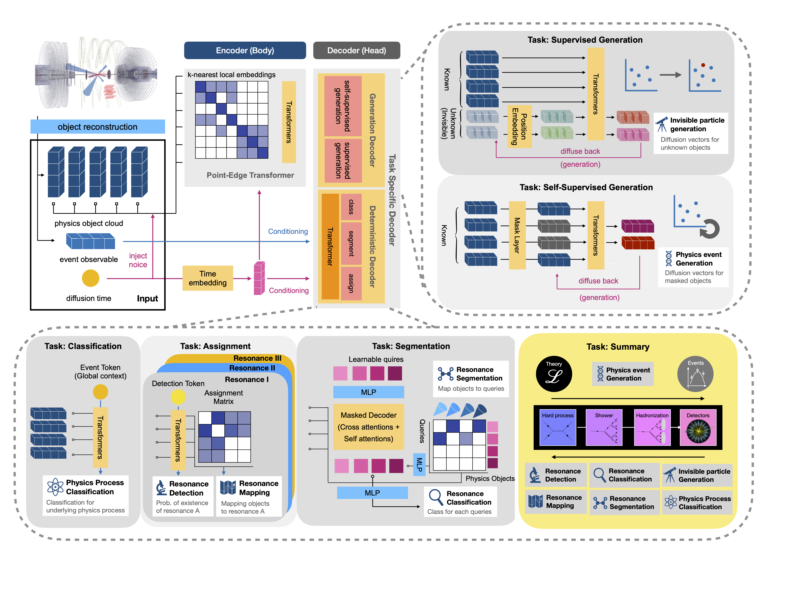

# EveNet 🌌

[](https://uw-epe-ml.github.io/EveNet_Public/)


EveNet is a pretrained, multi-task foundation model for event-level collider physics. 
It comes with a scalable Ray + PyTorch Lightning training pipeline, SLURM-ready multi-GPU infrastructure, 
and modular YAML configuration, 
so researchers can quickly fine-tune it on their own datasets and extend it to new physics analyses.

---



---

## 🚀 Quick Start (Docker + PyPI)

Set up a runnable EveNet environment in minutes:

1. Pull the pre-built CUDA image with all binary dependencies.
   ```bash
   docker pull docker.io/avencast1994/evenet:1.3
   docker run --gpus all -it docker.io/avencast1994/evenet:1.3
   ```
2. Inside the container (or any GPU-ready Python 3.12+ environment), install the EveNet package from PyPI.
   ```bash
   pip install evenet
   ```
3. Launch the bundled CLIs with your YAML configuration files.
   ```bash
   evenet-train share/finetune-example.yaml --ray_dir ~/ray_results
   evenet-predict share/predict-example.yaml
   ```

These entry points wrap the Ray + PyTorch Lightning pipelines documented in the [training](docs/train.md) and
[prediction](docs/predict.md) guides.

---

## 🧩 Advanced Development

Prefer to modify the source code? Clone this repository (or mount it into the Docker image) and work directly
with the modules under `evenet/`, the CLIs in `evenet/train.py` and `evenet/predict.py`, and the configuration
templates in `share/`. The documentation portal highlights the hooks and extension points for custom research
projects.

---

## 🎯 Pretrained Weights

Start directly from pretrained EveNet checkpoints for fine-tuning or inference:

👉 HuggingFace: [Avencast/EveNet](https://huggingface.co/Avencast/EveNet/tree/main)

---

## 📚 Documentation

Explore the full documentation site for setup options, configuration references, and tutorials:

[uw-epe-ml.github.io/EveNet_Public](https://uw-epe-ml.github.io/EveNet_Public/)

---

## 🤝 Contributing

Improvements are welcome! File an issue or open a pull request for bug fixes, new physics processes, or documentation tweaks.
When you add new components or datasets, update the relevant markdown guides so future users can follow along easily.
