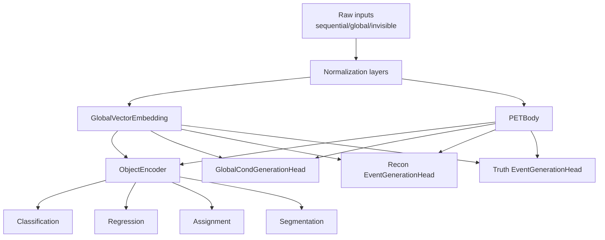

# EveNet Model Architecture

This document provides a diagrammatic walk-through of the `EveNetModel` defined in
`evenet/network/evenet_model.py`, focusing on how normalization, embeddings, the PET body,
object encoder, and the task-specific heads interact. Configuration references are drawn from
`share/network/pretrain.yaml`.

---

## High-Level Flow

*The exact modules that are instantiated depend on the `include_*` flags passed to the model constructor.* ([evenet/network/evenet_model.py](../evenet/network/evenet_model.py#L26-L316))

---

## Normalization Setup

The model builds dedicated `Normalizer` instances for each input channel type:

* **Sequential features** (`self.sequential_normalizer`) aggregate per-source masks/means/stds using
  `event_info.input_types` and the provided `normalization_dict`. This normalizer optionally supports
  inverse-CDF transforms via `sequential_inv_cdf_index`. ([evenet/network/evenet_model.py](../evenet/network/evenet_model.py#L57-L105))
* **Global features** (`self.global_normalizer`) default to identity statistics when no global inputs
  are declared, ensuring deterministic scaling for conditioning vectors. ([evenet/network/evenet_model.py](../evenet/network/evenet_model.py#L78-L105))
* **Invisible channels** (`self.invisible_normalizer`) are created only when neutrino generation is
  enabled, padding features to match the sequential width and applying inv-CDF indices when
  configured. The sequential normalizer is always applied to visible tracks, and invisible features
  are concatenated later with masks that forbid visible queries from attending to invisible keys in
  the PET attention map. ([evenet/network/evenet_model.py](../evenet/network/evenet_model.py#L90-L121)) ([evenet/network/evenet_model.py](../evenet/network/evenet_model.py#L389-L418)) ([evenet/network/evenet_model.py](../evenet/network/evenet_model.py#L395-L404))
* **Count features** (`self.num_point_cloud_normalizer`) normalize multiplicity inputs when global or
  point-cloud generation is active. ([evenet/network/evenet_model.py](../evenet/network/evenet_model.py#L107-L112))

The forward pass applies these normalizers to sequential tracks, invisible candidates, global
conditions, and counts before entering the embedding blocks. ([evenet/network/evenet_model.py](../evenet/network/evenet_model.py#L405-L430))

The input dictionary is expected to contain sequential clouds (`x` with `x_mask`), global
conditions (`conditions` with `conditions_mask`), task-specific targets, multiplicities, and optional
invisible channels (`x_invisible` with mask), as documented in the forward docstring. ([evenet/network/evenet_model.py](../evenet/network/evenet_model.py#L323-L387))

---

## Global Embedding

The `GlobalVectorEmbedding` projects normalized condition vectors into a learned context used by both
deterministic heads and diffusion decoders. ([evenet/network/evenet_model.py](../evenet/network/evenet_model.py#L123-L136)) Its behavior is
controlled by `Body.GlobalEmbedding`:

| Parameter | Description |
|-----------|-------------|
| `linear_block_type` (`GRU`) | Recurrent block used inside the embedding stack. |
| `transformer_dim_scale` (`2.0`) | Scaling factor for attention layers. |
| `initial_embedding_dim` (`16`) → `hidden_dim` (`256`) | Width progression from inputs to final embedding. |
| `normalization` (`LayerNorm`), `linear_activation` (`GELU`), `dropout` (`0.1`), `skip_connection` (`true`), `num_embedding_layers` (`8`) | Regularization and depth knobs. |

 ([share/network/pretrain.yaml](../share/network/pretrain.yaml#L7-L28))

During diffusion schedules, selective masking (`global_feature_mask`) zeroes out unused conditions for
reconstruction heads, while deterministic schedules keep all features active. ([evenet/network/evenet_model.py](../evenet/network/evenet_model.py#L471-L537))

---

## PET Body (Point-Event Transformer)

`PETBody` consumes the (optionally noise-injected) sequential features, integrating local point
patches indexed by `Body.PET.local_point_index`. Configurable aspects include feature dropout, hidden
size, local attention depth, transformer layers, and head counts for the shared trunk that feeds both
task heads and diffusion decoders. ([evenet/network/evenet_model.py](../evenet/network/evenet_model.py#L138-L156)) ([share/network/pretrain.yaml](../share/network/pretrain.yaml#L16-L41))

Depending on the active schedule, PET receives different attention masks and diffusion times:

* **Deterministic schedule:** clean inputs, zero time, no extra attention mask.
* **Reconstruction schedule:** stochastic noise masks sample subsets of sequential features, optionally
  enabling attention sparsification via `reco_attn_mask`.
* **Neutrino schedule:** concatenates normalized invisible features, enforcing visibility-aware
  masking so visible queries cannot attend to invisible keys. ([evenet/network/evenet_model.py](../evenet/network/evenet_model.py#L471-L537)) ([evenet/network/evenet_model.py](../evenet/network/evenet_model.py#L507-L637))

---

## Object Encoder

When deterministic heads are requested, the PET output is passed through an `ObjectEncoder` that
combines token-wise embeddings with the global context (including an event token) before branching to
heads. ([evenet/network/evenet_model.py](../evenet/network/evenet_model.py#L158-L548)) Major configuration knobs reside under
`Body.ObjectEncoder`, covering hidden size, positional embedding width, attention head count, encoder
layers, and dropout/skip-connection toggles. ([share/network/pretrain.yaml](../share/network/pretrain.yaml#L43-L58))

The encoder returns per-object embeddings, a conditioned global representation, and an event token
used by classification, regression, assignment, and segmentation modules. ([evenet/network/evenet_model.py](../evenet/network/evenet_model.py#L539-L599))

---

## Deterministic Heads

### Classification Head

* Instantiated when `include_classification` is true. Accepts object embeddings and predicts per-event
  class logits, optionally attending to the event token. ([evenet/network/evenet_model.py](../evenet/network/evenet_model.py#L175-L187)) ([evenet/network/evenet_model.py](../evenet/network/evenet_model.py#L582-L588))
* Tuned via `Classification` configuration: depth (`num_classification_layers`), hidden width (`hidden_dim`),
  dropout, skip connections, and multi-head attention count. ([share/network/pretrain.yaml](../share/network/pretrain.yaml#L60-L70))

### Regression Head

* Enabled by `include_regression`. Operates on the event token and rescales predictions using the
  regression mean/std entries from the normalization dictionary. ([evenet/network/evenet_model.py](../evenet/network/evenet_model.py#L189-L199)) ([evenet/network/evenet_model.py](../evenet/network/evenet_model.py#L590-L594))
* Controlled by `Regression` settings (layer count, hidden size, dropout, skip). ([share/network/pretrain.yaml](../share/network/pretrain.yaml#L72-L81))

### Assignment Head

* Built with `SharedAssignmentHead` when `include_assignment` is set. It consumes embeddings, global
  conditioning, and event tokens to produce resonance-to-object assignments and detection scores while
  respecting physics symmetries provided in `event_info`. ([evenet/network/evenet_model.py](../evenet/network/evenet_model.py#L204-L237)) ([evenet/network/evenet_model.py](../evenet/network/evenet_model.py#L554-L569))
* Configured via the `Assignment` block, which exposes feature dropout, transformer depth, symmetric
  attention splitting, and event-token encoding options. ([share/network/pretrain.yaml](../share/network/pretrain.yaml#L83-L109))

### Segmentation Head

* Available when `include_segmentation` is true. Consumes object memory and the event token to predict
  mask logits and optional auxiliary outputs for multiple queries. ([evenet/network/evenet_model.py](../evenet/network/evenet_model.py#L296-L310)) ([evenet/network/evenet_model.py](../evenet/network/evenet_model.py#L570-L581)) ([evenet/network/evenet_model.py](../evenet/network/evenet_model.py#L643-L657))
* Tied to `Segmentation` hyperparameters: projection dimension (shared with mask width), attention heads,
  transformer depth, number of queries, intermediate returns, and normalization order. ([share/network/pretrain.yaml](../share/network/pretrain.yaml#L111-L122))

The model reports deterministic outputs only for schedules that keep `schedule_name == "deterministic"` in
`self.schedule_flags`. These flags are populated based on the `include_*` booleans supplied to the
constructor. ([evenet/network/evenet_model.py](../evenet/network/evenet_model.py#L312-L316)) ([evenet/network/evenet_model.py](../evenet/network/evenet_model.py#L463-L600))

---

## Generation Heads and Diffusion Pathways

EveNet supports three diffusion outputs, each gated by its corresponding `include_*` flag and schedule:

1. **Global generation (`include_global_generation`):**
   * Uses `GlobalCondGenerationHead` to denoise multiplicities plus selected global targets, conditioned
     on the embedded global vector and class labels. ([evenet/network/evenet_model.py](../evenet/network/evenet_model.py#L239-L255)) ([evenet/network/evenet_model.py](../evenet/network/evenet_model.py#L431-L454))
   * Hyperparameters: residual block depth (`num_resnet_layers`), transformer layers, hidden/residual
     width, stochastic depth dropout, and activation. ([share/network/pretrain.yaml](../share/network/pretrain.yaml#L124-L134))
   * Inputs are normalized counts concatenated with target globals; outputs supply predicted and ground
     truth vectors for diffusion losses. ([evenet/network/evenet_model.py](../evenet/network/evenet_model.py#L431-L454))

2. **Reconstruction (visible point cloud) generation (`include_point_cloud_generation`):**
   * `EventGenerationHead` consumes PET embeddings, global context, normalized counts, and diffusion time.
     Noise is injected according to `progressive_params["noise_prob"]`, with optional attention masking
     via `reco_attn_mask` to gradually expand receptive fields. ([evenet/network/evenet_model.py](../evenet/network/evenet_model.py#L258-L274)) ([evenet/network/evenet_model.py](../evenet/network/evenet_model.py#L471-L537)) ([evenet/network/evenet_model.py](../evenet/network/evenet_model.py#L603-L622))
   * Config is shared under `ReconGeneration`: projection dimension, layer depth, head count, dropout,
     layer scaling, and stochastic depth probability. Progressive training can adjust `noise_prob` and
     `time_masking` to control which features are diffused at each curriculum stage. ([share/network/pretrain.yaml](../share/network/pretrain.yaml#L136-L146)) ([evenet/network/evenet_model.py](../evenet/network/evenet_model.py#L480-L517))

3. **Neutrino (invisible) generation (`include_neutrino_generation`):**
   * Another `EventGenerationHead` targets invisible features, optionally applying positional encodings
     when `TruthGeneration.neutrino_position_encode` is true. Visible and invisible channels are
     concatenated with attention masks so only invisible queries attend to invisible keys during
     denoising. ([evenet/network/evenet_model.py](../evenet/network/evenet_model.py#L276-L293)) ([evenet/network/evenet_model.py](../evenet/network/evenet_model.py#L507-L641))
   * Controlled via `TruthGeneration`: hidden size, transformer depth, head count, dropout, layer scaling,
     and positional encoding length. The normalization padding ensures outputs match the sequential
     dimensionality before slicing out invisible predictions. ([share/network/pretrain.yaml](../share/network/pretrain.yaml#L148-L160)) ([evenet/network/evenet_model.py](../evenet/network/evenet_model.py#L90-L121)) ([evenet/network/evenet_model.py](../evenet/network/evenet_model.py#L618-L641))

All diffusion pathways rely on the shared `schedule_flags` to determine when each head participates in a
forward pass, enabling progressive curricula that alternate deterministic and stochastic objectives. The
loops over `(schedule_name, flag)` govern which branches execute, while `time` and `add_noise` encode the
forward diffusion process controlled by `progressive_params` (noise probability and attention masking). ([evenet/network/evenet_model.py](../evenet/network/evenet_model.py#L312-L641))

Additional helper APIs (`predict_diffusion_vector`) reuse the same normalization, embedding, and head
logic for inference-time sampling in global, reconstruction, or neutrino modes. ([evenet/network/evenet_model.py](../evenet/network/evenet_model.py#L659-L800))

---

## Output Summary

The combined forward output dictionary bundles deterministic predictions (classification, regression,
assignments, segmentation) and diffusion targets (global, point cloud, neutrino), along with the current
`alpha` extracted from the diffusion schedule. Missing branches return `None` when their `include_*`
flags are disabled. ([evenet/network/evenet_model.py](../evenet/network/evenet_model.py#L643-L657))

---

## Conditional Construction Overview

* **Instantiation:** Each head/body block is created only if its associated `include_*` flag is true, so
  YAML configurations can be shared across tasks even when certain heads are inactive. ([evenet/network/evenet_model.py](../evenet/network/evenet_model.py#L46-L310))
* **Normalization dictionaries:** The constructor stitches together per-input normalization stats and
  applies them during forward, ensuring consistent scaling for sequential, global, and invisible channels
  regardless of which schedules execute. ([evenet/network/evenet_model.py](../evenet/network/evenet_model.py#L57-L121)) ([evenet/network/evenet_model.py](../evenet/network/evenet_model.py#L405-L430))
* **Progressive schedules:** `self.schedule_flags` ties these booleans to the runtime loop, enabling
  stage-wise training curricula (e.g., deterministic-only warmup, gradual diffusion activation). Noise
  masks, time masking, and optional attention pruning are all derived from `progressive_params`, allowing
  advanced scheduling strategies without changing the model definition. ([evenet/network/evenet_model.py](../evenet/network/evenet_model.py#L312-L637))

---

By aligning the configuration YAML with the `include_*` toggles and normalization dictionaries, the same
`EveNetModel` class can serve classification/regression workloads, assignment tasks, segmentation, and
multi-branch diffusion generation within a unified training schedule.
