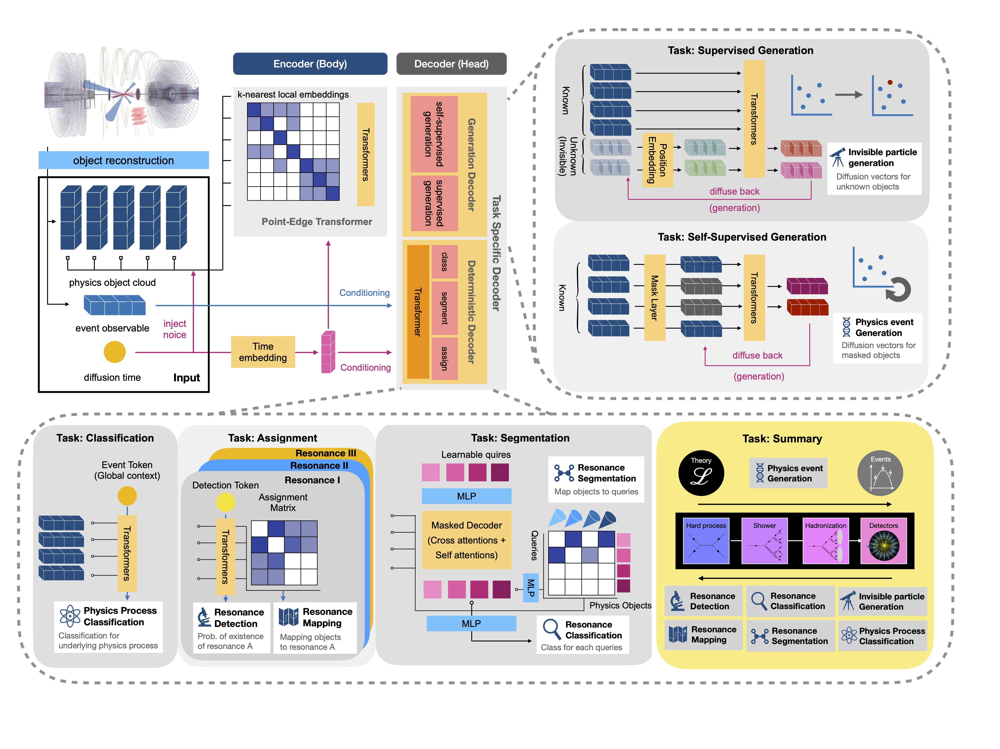

# 🧠 Model Architecture Tour

Take a guided walk through EveNet’s multitask architecture—from input normalization to the specialized heads. Pair this with the [configuration guide](configuration.md) to see how YAML choices shape each component.

- [Signal flow at a glance](#signal-flow)
- [Input normalization](#input-normalization)
- [Shared body](#shared-body)
- [Task heads](#task-heads)
- [Progressive training hooks](#progressive-training)
- [Customizing the network](#customizing)

---

## 🔁 Signal Flow at a Glance

Inputs are split into point-cloud tensors and global per-event features. Explicit supervision arrives through the target nodes shown on the right, while the reconstruction head trains against the noisy point-cloud inputs it perturbs. Each module in the flow is instantiated inside [`evenet/network/evenet_model.py`](../evenet/network/evenet_model.py) using the options loaded from your YAML files. The optional global-diffusion network is configured separately and conditions on the same normalized scalars.

---

## 🧴 Input Normalization

When `EveNetModel` is built, it grabs feature statistics from `normalization.pt` plus schema details from `event_info` and constructs a collection of `Normalizer` layers:

- **Sequential features** (`INPUTS/Source`) use a `Normalizer` that understands mixed discrete/continuous distributions and optional inverse-CDF indices.
- **Global features** (`INPUTS/Conditions`) map through a second `Normalizer` sized to the event-level vector.
- **Multiplicity channels** (`num_vectors`, `num_sequential_vectors`) are normalized when generation heads are active.
- **Invisible particle targets** reuse the sequential embedding width and are padded to `max_neutrinos` so diffusion heads can operate consistently whenever truth-level supervision is available.

Implementation details live near the top of [`evenet/network/evenet_model.py`](../evenet/network/evenet_model.py#L1-L120).

---

## 🧱 Shared Body

### 🌐 Global Embedding
`GlobalVectorEmbedding` converts the condition vector into learned tokens. Hyperparameters like depth, hidden dimension, dropout, and activation come from the `Body.GlobalEmbedding` block described in the [configuration reference](configuration.md#network-templates).

### 🧲 PET Body
`PETBody` processes the sequential particle cloud with transformer-style layers, local neighborhood attention, and optional stochastic feature dropping. Configure `num_layers`, `num_heads`, `feature_drop`, and `local_point_index` under `Body.PET` in your network block (see [configuration reference](configuration.md#network-templates)).

### 🧵 Object Encoder
Outputs from the PET body and global tokens meet in the `ObjectEncoder`, which mixes information across objects. Attention depth, head counts, positional embedding size, and skip connections are controlled by `Body.ObjectEncoder` (see [configuration reference](configuration.md#network-templates)).

---

## 🎯 Task Heads

Heads are instantiated only when `options.Training.Components.<Head>.include` is `true`. EveNet groups them into discriminative predictors that score events and objects, and generative heads that either reconstruct their own inputs or learn diffusion processes against explicit supervision.

### 🔍 Discriminative Heads

#### 🏷️ Classification
Predicts process probabilities using `ClassificationHead`. Configure layer counts, hidden size, dropout, and optional attention under `Classification` in the network YAML (see [configuration reference](configuration.md#network-templates)).

#### 📈 Regression
`RegressionHead` regresses continuous targets (momenta, masses). Normalization tensors (`regression_mean`, `regression_std`) are injected so outputs can be de-standardized. Hyperparameters mirror the classification head (see [configuration reference](configuration.md#network-templates)).

#### 🔗 Assignment
`SharedAssignmentHead` tackles combinatorial matching between reconstructed objects and truth daughters defined in `event_info`. It leverages symmetry-aware attention and optional detection layers. Tune `feature_drop`, attention heads, and decoder depth via the `Assignment` block (see [configuration reference](configuration.md#network-templates)).

#### 🌈 Segmentation
`SegmentationHead` predicts binary masks for resonance-specific particle groups. Configure the number of queries, transformer layers, and projection widths in the `Segmentation` block (see [configuration reference](configuration.md#network-templates)).

### 🌬️ Generative Heads

Two sibling diffusion heads branch off from the shared body, each with a distinct training objective, plus an optional standalone module for scalar generation:

| Head              | Objective type                 | Input features                                                  | Supervision                                                                               | Notes                                                                                                                                   |
|-------------------|--------------------------------|-----------------------------------------------------------------|-------------------------------------------------------------------------------------------|-----------------------------------------------------------------------------------------------------------------------------------------|
| `ReconGeneration` | Self-supervised reconstruction | PET embeddings + global tokens before the object encoder.       | No external targets—the head denoises the noisy visible point-cloud channels it perturbs. | Shares the PET backbone directly so reconstruction quality reflects the sequential encoder capacity. Configure under `ReconGeneration`. |
| `TruthGeneration` | Supervised generation          | PET embeddings + global tokens with optional invisible padding. | Padded invisible particle features (e.g., neutrinos) supplied in the dataset.             | Mirrors the reconstruction architecture but learns to sample toward truth-level targets. Settings sit under `TruthGeneration`.          |

> 💡 `GlobalGeneration` remains available as an **independent** diffusion network for event-level scalars. It conditions on the normalized global tokens but does not connect through the PET/ObjectEncoder stack, so you can enable or disable it without affecting the primary generative heads.

---

## 🌀 Progressive Training Hooks

`EveNetModel` exposes `schedule_flags` describing which heads are active (diffusion, neutrino, deterministic). The training loop combines these flags with the curriculum defined in `options.ProgressiveTraining` so that loss weights, dropout, EMA decay, or teacher-forcing gradually adjust across stages. Inspect the scheduling logic in [`evenet/network/evenet_model.py`](../evenet/network/evenet_model.py#L352-L380) and pair it with the YAML stages summarized in the [configuration reference](configuration.md#options-deep-dive).

---

## 🛠️ Customizing the Network

1. **Pick a template** – choose a network block described in the [configuration reference](configuration.md#network-templates) and copy it into your experiment YAML.
2. **Override selectively** – in your top-level YAML, override only the fields you want to tweak (e.g., set `Body.PET.feature_drop: 0.0` for fine-tuning).
3. **Match supervision** – enable heads under `options.Training.Components` only when the dataset provides the required targets.
4. **Refresh normalization** – if you change the input schema in `event_info`, rerun preprocessing so new statistics land in `normalization.pt` (see the saving logic in [`preprocessing/postprocessor.py`](../preprocessing/postprocessor.py#L360-L406)).

With these controls, you can resize EveNet for tiny studies or scale it up for production campaigns—all while keeping the codepath consistent.

