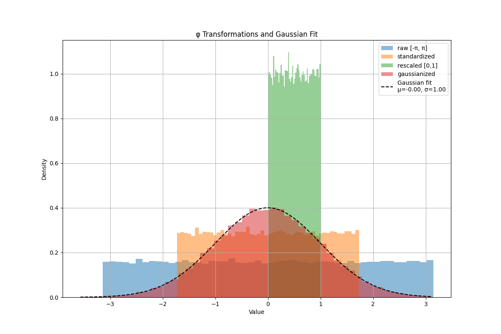

# Neutrino Generation Study

- reference link: https://zenodo.org/records/8113516
- dataset link: https://zenodo.org/api/records/8113516/files-archive

```bash
wget --content-disposition "https://zenodo.org/api/records/8113516/files-archive"
```

To run data preprocessing, go to main directory and run the following command:

```bash
#!/bin/bash

PREPROCESS_SCRIPT="downstreams/nu2flow/preprocess/preprocess_nu2flow.py"
YAML_CONFIG="downstreams/nu2flow/preprocess.yaml"
IN_BASE="/global/cfs/cdirs/m2616/avencast/Event_Level_Analysis/data/nu2flow"
OUT_BASE="$PSCRATCH/Event_Level_Analysis/Pretrain_Parquet/nu2flow"

for dataset in mg5_test mg5_train pythia_test pythia_train; do
#for dataset in train; do
    shifter python3 "$PREPROCESS_SCRIPT" "$YAML_CONFIG" \
        --in_dir "$IN_BASE/$dataset" \
        --store_dir "$OUT_BASE/$dataset"
done
```


To run the training, go to main directory and run the following command:
```
python evenet/train.py downstreams/nu2flow/train.yaml --load_all
```

To run the evaluation, go to main directory and run the following command:
```
python evenet/predict.py downstreams/nu2flow/predict.yaml
```

## Testing Phi Transformation

```python
import math
import torch
import matplotlib.pyplot as plt
import numpy as np
from scipy.stats import norm
import pandas as pd

df = pd.read_parquet("/Users/avencastmini/PycharmProjects/EveNet/workspace/test_data/SPANet.store.nu2flow/data_nu2flow.parquet")
a = torch.load("/Users/avencastmini/PycharmProjects/EveNet/workspace/test_data/SPANet.store.nu2flow/normalization.pt")
# Given
raw = df['x_invisible:0:3']
mean = a['invisible_mean']['Source'][3].numpy()
std = a['invisible_std']['Source'][3].numpy()
# Step 1: Standardize
n_1 = (raw - mean) / std
# Step 2: Rescale to [0,1] assuming [-sqrt(3), sqrt(3)]
scale = math.sqrt(3)
n_1_scaled = (n_1 + scale) / (2 * scale)
n_1_scaled = torch.clamp(torch.tensor(n_1_scaled), 1e-6, 1-1e-6)
# Step 3: Inverse CDF to get Gaussianized φ
normal = torch.distributions.Normal(0, 1)
n_2 = normal.icdf(n_1_scaled)
# Convert tensors to numpy
n_1_np = n_1
n_1_scaled_np = n_1_scaled
n_2_np = n_2
raw_np = raw
# Step 4: Plot all together
plt.figure(figsize=(12, 8))
# Raw φ
plt.hist(raw_np, bins=50, alpha=0.5, label='raw [-π, π]', density=True)
# Standardized φ
plt.hist(n_1_np, bins=50, alpha=0.5, label='standardized', density=True)
# Rescaled φ
plt.hist(n_1_scaled_np, bins=50, alpha=0.5, label='rescaled [0,1]', density=True)
# Gaussianized φ
counts, bins, _ = plt.hist(n_2_np, bins=50, alpha=0.5, label='gaussianized', density=True)
# Fit a Gaussian on n_2 and plot
mu, sigma = norm.fit(n_2_np)
x_fit = np.linspace(bins[0], bins[-1], 100)
pdf_fit = norm.pdf(x_fit, mu, sigma)
plt.plot(x_fit, pdf_fit, 'k--', label=f'Gaussian fit\nμ={mu:.2f}, σ={sigma:.2f}')
# Plot formatting
plt.legend()
plt.title('φ Transformations and Gaussian Fit')
plt.xlabel('Value')
plt.ylabel('Density')
plt.grid(True)
plt.show()
```



## Unfolding 

The library I used is [RooUnfold](https://gitlab.cern.ch/RooUnfold/RooUnfold/-/tree/master?ref_type=heads).

```bash
# install
git clone ssh://git@gitlab.cern.ch:7999/yulei/RooUnfold.git
cd RooUnfold

mkdir build && cd build
cmake ..
make -j 4
source setup.sh

# setup.sh is equivalent to
# export PATH=$PATH:$PWD
# export LD_LIBRARY_PATH=$LD_LIBRARY_PATH:$PWD
# export PYTHONPATH=$PYTHONPATH:$PWD
```

> Remember to add `ROOT::RooFitCore ROOT::RooFit ROOT::RooFitJSONInterface` to CMake if you are using ROOT 6.34 or later. 

